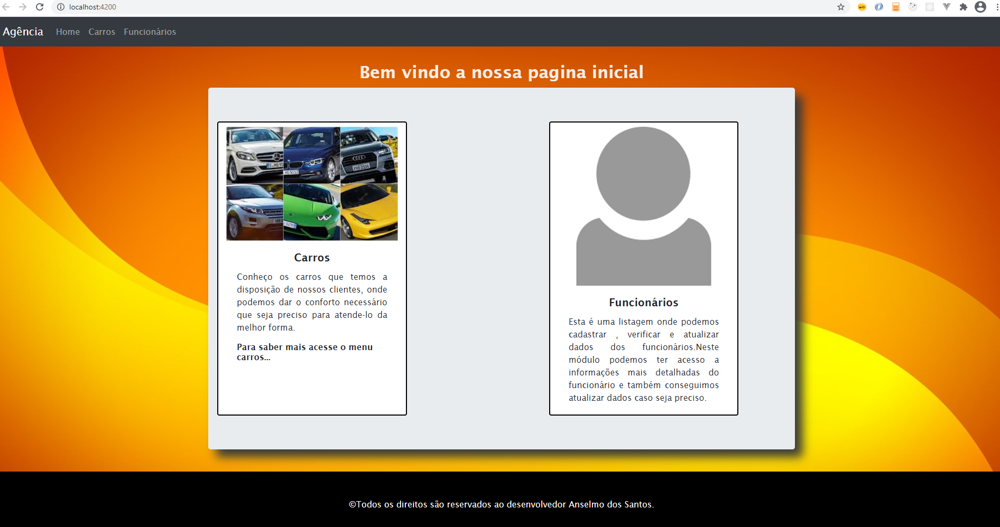
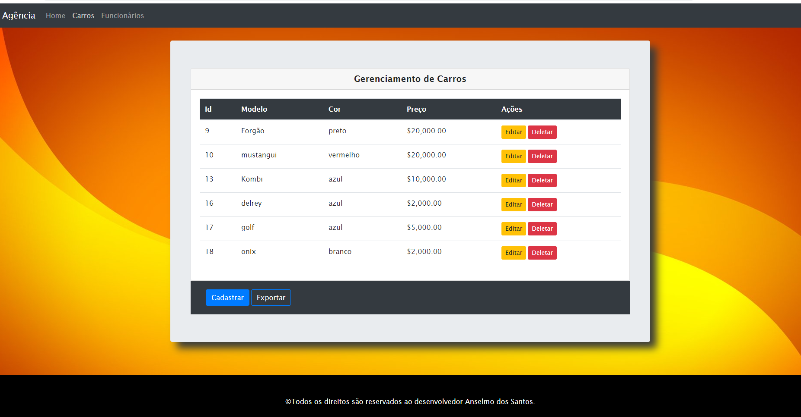

# Agencia de Carros

## tela de listagem de carros 

## Instalar dependencias
instalar os pacotes
npm install 

## Rodar o mock server digitando na linha de comando
json-server --watch src/assets/data/db.json

## Rodar o projeto local
npm start
Run `ng serve` for a dev server. Navigate to `http://localhost:4200/`. The app will automatically reload if you change any of the source files.

## Build
Run `ng build` to build the project. The build artifacts will be stored in the `dist/` directory. Use the `--prod` flag for a production build.

